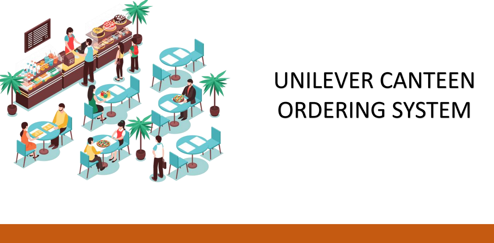

# Unilever-Canteen-Ordering-System

Unilever employees waste a lot of time during lunch. the process must be reviewed and streamlined to create better employee lunch time experience, in return this will increase their productivity which invariably leads to more revenue generation for Unilever.

## Background 
Unilever is a British-Dutch FMCG company, headquartered in London, England. Unilever is one of the oldest FMCG companies, and its products are available in around 190 countries. In its UK offices, Unilever has around 1500 employees which are spread across 12 floors. They have 2 canteens to cater to these 1500 employees. Each canteen can seat around 150 employees at a time.

## Problem Statement

| Issue                            | Description                                                                                                      |
|----------------------------------|------------------------------------------------------------------------------------------------------------------|
| Lengthy Wait Times               | It takes approximately 60 minutes for employees to go to the canteen, wait in queues, collect their food, and find a table. This time can be better utilised for work or relaxation. |
| Limited Food Choices             | Employees often do not get the food they desire due to items running out of stock in the canteens.                  |
| Food Wastage                     | The canteens currently dispose of a significant amount of unsold food, resulting in financial losses and environmental concerns. |

